# E-Commerce  İlmek

# 🚀 E-Commerce Platform

This project is a dynamic **e-commerce platform** developed using **C# and Entity Framework**. The platform is designed as two separate projects: **MVC (front-end) 🎨** and **API (back-end) 🔧**. Users will be able to log in securely using **JWT Authentication 🔐**, and the platform will include **Admin, Seller, and User** roles.

---
## 🛠 Technologies
### 🎯 Technologies Used in API (Completed ✅)
- **C#** - Primary programming language
- **Entity Framework Core** - ORM for database operations
- **JWT Authentication** - User authentication
- **SQL Server** - Database management
- **Fluent API** - Database modeling and relationships
- **Identity Framework** - User authentication and identity management
- **MailKit & MimeKit** - 📧 Email communication
- **Fluid.Core** - 📝 Template-based content generation
- **Options Pattern** - Configuration management
- **Validation Annotation** - Model validation
- **HTTP Attribute Model** - HTTP request management for API
- **Repository Pattern** - 📦 Database operations
- **Unit of Work** - 🔄 Managing database transactions
- **Authorization Policy** - Access control policies
- **AutoMapper** - 🛠 Object mapping
- **IoC Container** - Dependency injection

### 🎨 Technologies Used in MVC
- **ASP.NET Core MVC** - Front-end application architecture
- **ASP.NET Core Tag Helpers** - HTML rendering and form handling
- **Toaster** - 🔔 Notifications
- **Bootstrap** - 🎭 Responsive and modern UI design
- **CSS, HTML, JavaScript** - Styling and interactivity
- **HTTP Client** - 🌐 API data exchange
- **Cookie Management** - 🍪 User session management
- **Postman** - API testing

---
## 🏛 Architecture
The project follows an **N-Layer Architecture**:
- **Presentation Layer (MVC) 🎭** - User interface
- **Business Logic Layer (API) ⚙️** - Business logic and API
- **Data Access Layer 🗄** - Database operations

---
## ✅ Features Completed in API
- **JWT Authentication** for secure session management 🔐
- **User, Seller, and Admin Roles** 🏢
- **Category and Subcategory Management** 📂
- **Product Listing, Adding, Updating, Deleting** 🛍
- **Product Filtering (Price, Color, Size)** 🎨
- **Order Management** 📦
- **User and Seller Profile Management** 👤
- **Order Tracking and Order History** 📜
- **Coupon and Discount Management** 🎟
- **Contact Messages Management** 📩
- **Email Notifications (Order Confirmation, Password Reset, Welcome Messages)** 📧
- **Product Reviews and Ratings** ⭐️
- **User Favorite List Management** ❤️
- **Invoice Management and Generation** 🧾

---
## 🚀 Planned Features for MVC
- **Seller Registration and Dashboard Access** 🏪
- **Admin and Seller Dashboard** 📊
- **Invoice Viewing** 🧾
- **Ability to Review Purchased Products** ✍️
- **Contacting Admin** 📞
- **Adding Products to Favorites** ❤️
- **User Registration and Login Screens** 📝
- **Seller Panel and Product Management** 🛍
- **Product Listing and Detail Pages** 🔍
- **Product Filtering and Search Features** 🏷
- **Order Tracking and Order History Viewing** 📦
- **User Notifications and Message Management** 📬
- **Cart Management and Payment Integration** 💳

---

**API Testing**
Postman will be used to test all API endpoints

## 🌟 Future Enhancements
- **💰 Payment Integration** (Stripe, PayPal, etc.)
- **📈 SEO Optimization**
- **🔑 Additional User Roles and Authorization Improvements**

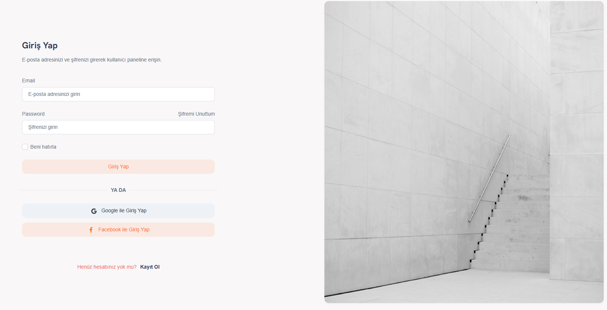
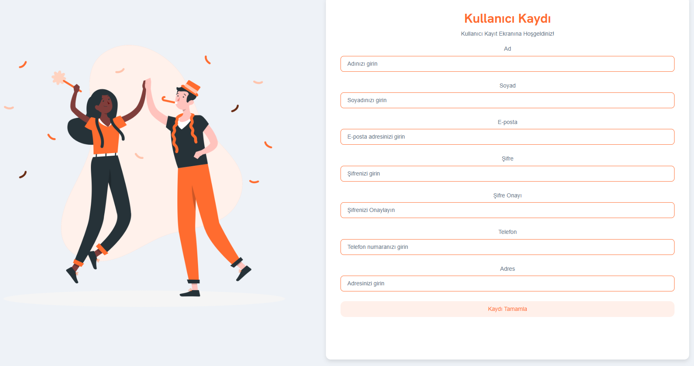
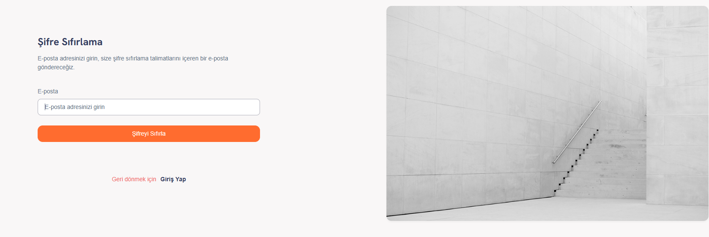
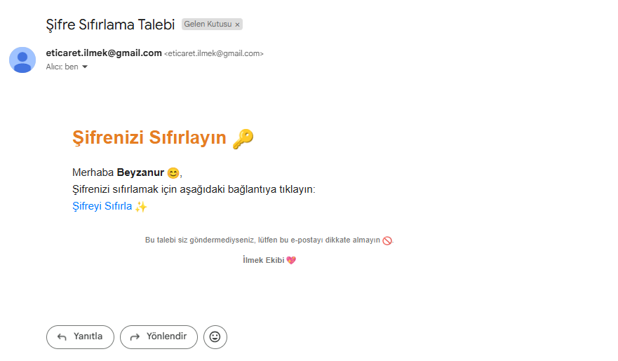
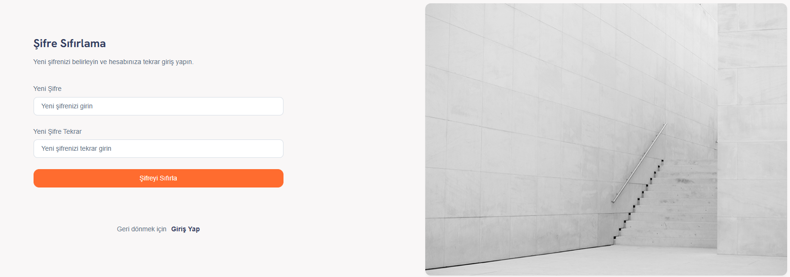
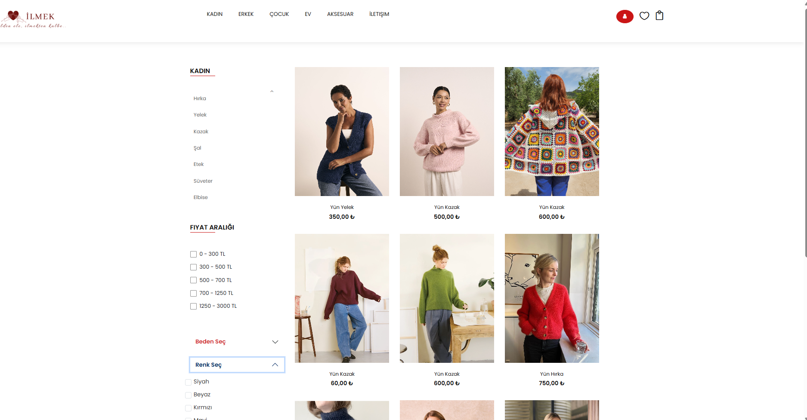
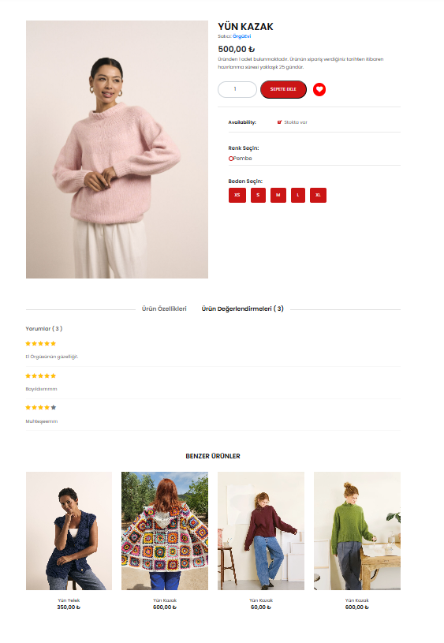

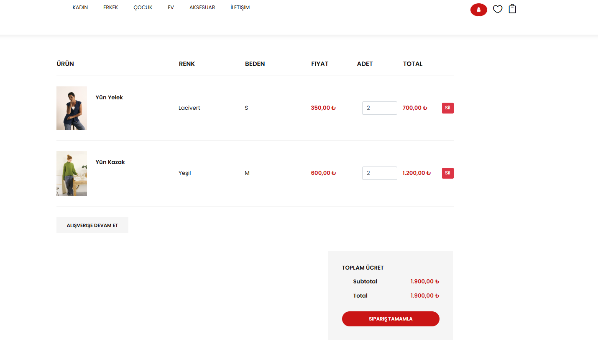
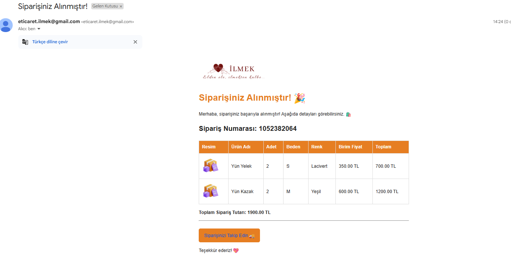
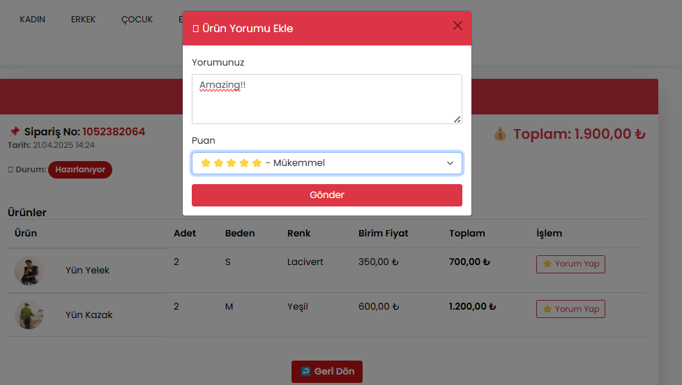
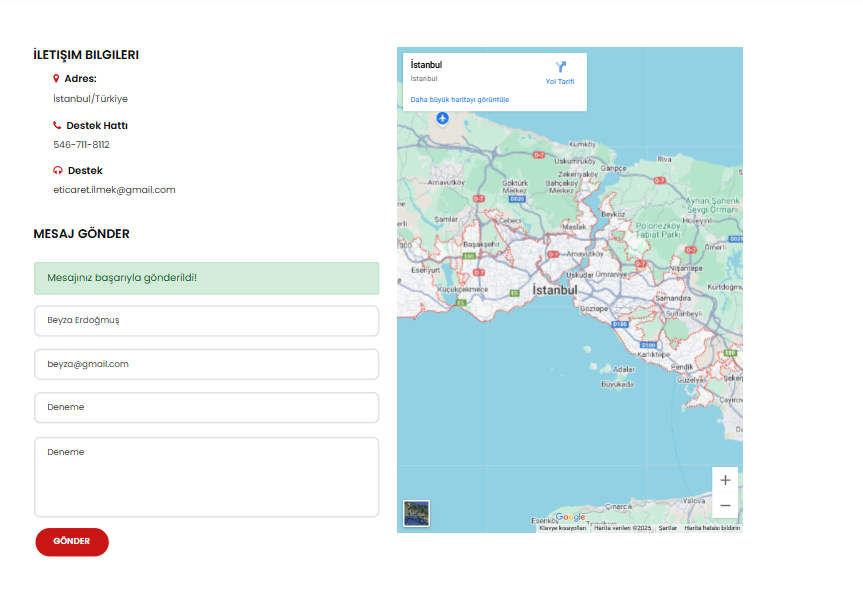

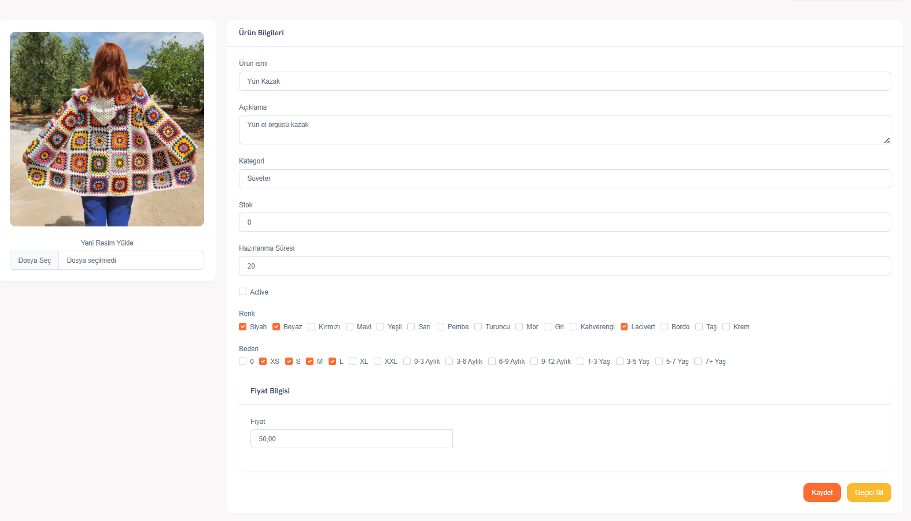
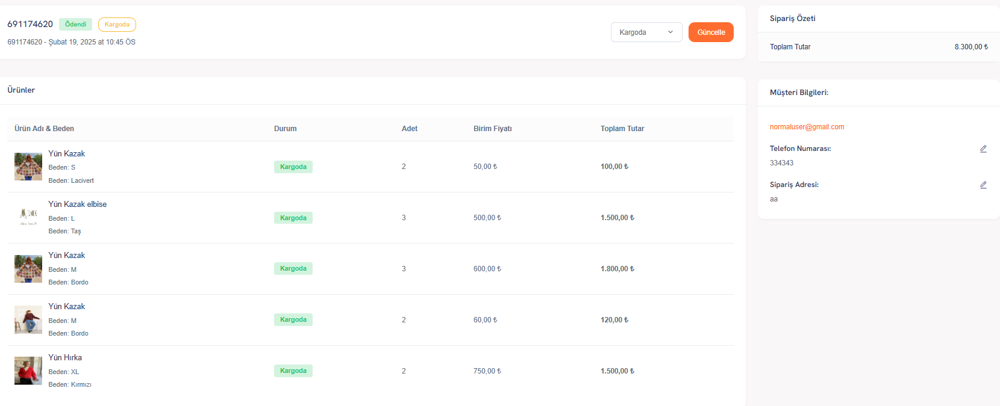

